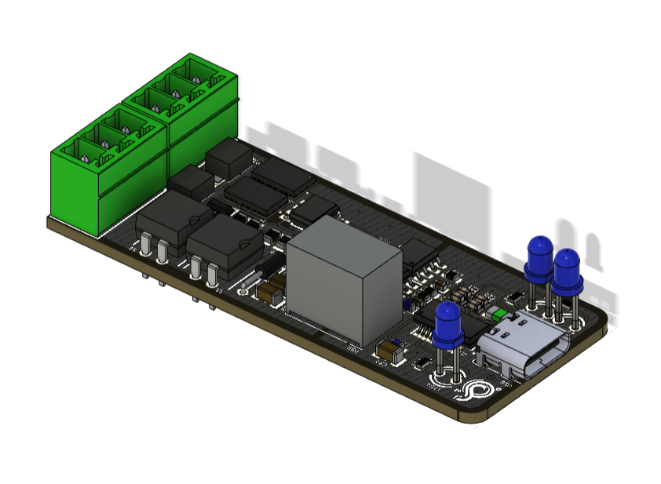
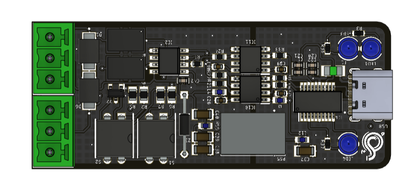
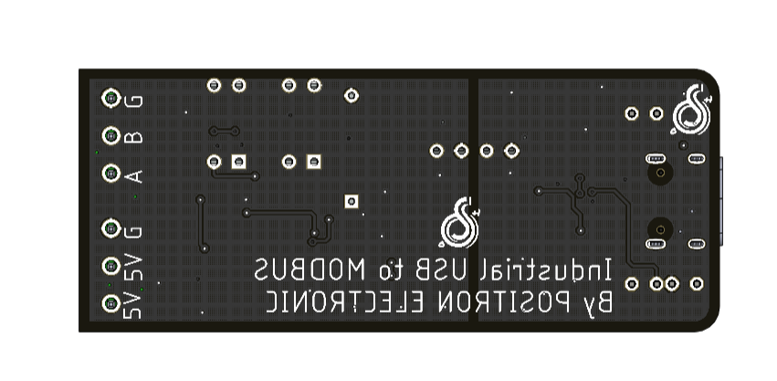

# Isolated-USB-to-RS485

## Spesification
- FTDI231XS
as IC TTL can programmed VID and PID 
- USB TYPE C
- MAX485
as IC Converter to RS485
- LED TX
- LED RX
- LED POWER 
- Isolated power 5V 
- ADUM1201
as Isolated data
- Terminal Block 3.81mm
- Terminal Block Power 5V
- SD 
## Preview Hardware

  
  
  

