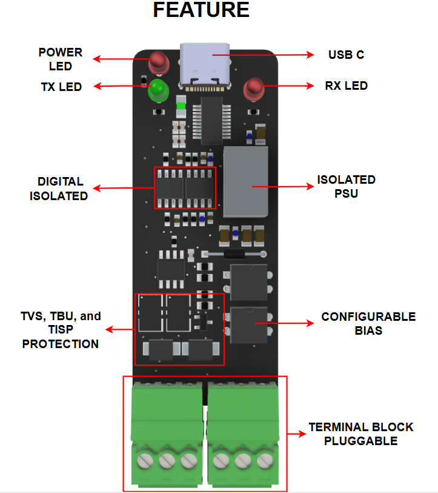

# Industrial USB to RS485 Adapter

USB Type-C to isolated half-duplex RS485 interface for Modbus RTU and other UART-based industrial networks.

<p align="center">
  
</p>

## Product Summary

This board converts a USB serial connection into an electrically isolated RS485 bus. It is suitable for connecting a computer, single-board computer, or industrial controller to RS485/Modbus RTU equipment.

```text
USB Type-C -> FT231XS UART -> ADuM1201 isolation -> MAX485 -> RS485 A/B
```

The design files are provided for evaluation, manufacturing, and integration. Read the limitations and validation notes before using the board in a safety-critical or compliance-regulated product.

## Features

- USB Type-C USB 2.0 connection
- FTDI FT231XS USB-to-UART bridge
- 3.3 V UART I/O configuration
- Isolated UART data path using ADuM1201ARZ
- Isolated 5 V supply using IL0505S
- MAX485 half-duplex RS485 transceiver
- RS485 A, B, and isolated ground connector
- Selectable RS485 termination and bias networks
- RS485 transient protection using SM712, TBU, and TISP devices
- TX, RX, and power status indicators
- Resettable USB input protection
- Separate isolated 5 V output connector
- Eagle schematic, board, libraries, Gerber archive, 3D model, and enclosure files

## Quick Start

1. Connect the board to a host computer using a USB Type-C data cable.
2. Install the FTDI VCP driver if the operating system does not install it automatically.
3. Identify the new serial port.
4. Connect RS485 `A`, `B`, and optionally `GNDA` to the target equipment.
5. Configure the host application for the target baud rate, parity, stop bits, and protocol.
6. Enable termination only when this adapter is at a physical end of the RS485 bus.
7. Enable bias only when this adapter is the designated bias point for the bus.

## Connector Pinout

See the visual pinout: [`DOC/HARDWARE/Pinout.png`](DOC/HARDWARE/Pinout.png).

| Connector | Pin | Function |
|---|---:|---|
| RS485 | 1 | `GNDA` / isolated ground |
| RS485 | 2 | `B` |
| RS485 | 3 | `A` |
| POWER | 1 | `GNDA` |
| POWER | 2 | `VCC`, isolated 5 V |
| POWER | 3 | `VCC`, isolated 5 V |

Confirm connector orientation against the silkscreen and pinout image before wiring.

## Design Files

| Resource | Location |
|---|---|
| Schematic PDF | [`PDF/Schematic.pdf`](PDF/Schematic.pdf) |
| Eagle schematic | [`PCB-EAGLE/IndustrialUSBtoModbus.sch`](PCB-EAGLE/IndustrialUSBtoModbus.sch) |
| Eagle board | [`PCB-EAGLE/IndustrialUSBtoModbus.brd`](PCB-EAGLE/IndustrialUSBtoModbus.brd) |
| Manufacturing Gerbers | [`CAD-CAM/Gerber.zip`](CAD-CAM/Gerber.zip) |
| Production PCB | [`PCB-EAGLE/IndustrialUSBtoModbus_Production.brd`](PCB-EAGLE/IndustrialUSBtoModbus_Production.brd) |
| Production Gerbers | [`CAD-CAM/Gerber_Production.zip`](CAD-CAM/Gerber_Production.zip) |
| Production CAM job | [`CAD-CAM/IndustrialUSBtoModbus v2.cam`](CAD-CAM/IndustrialUSBtoModbus%20v2.cam) |
| Board dimensions | [`DOC/Dimension.pdf`](DOC/Dimension.pdf) |
| STEP model | [`3D/IndustrialUSBtoModbus.step`](3D/IndustrialUSBtoModbus.step) |
| Enclosure models | [`3D/Case/`](3D/Case/) |
| Custom Eagle libraries | [`PCB-EAGLE/lib/`](PCB-EAGLE/lib/) |

Detailed documentation is in [`docs/`](docs/).

For manufacturing, use the files marked **Production**. The production Gerber archive contains Gerber, drill, solder-paste, pick-and-place, job, and ODB++ outputs generated from the production PCB revision.

## Important Limitations

- This is a half-duplex RS485 hardware interface; it does not implement Modbus protocol in hardware.
- RS485 termination, bias values, isolation spacing, and protection ratings require system-level verification.
- Cable length, baud rate, node count, and bus topology depend on the transceiver, cable, and installation.
- Custom FTDI VID/PID programming requires valid ownership/licensing and separate production configuration.

## Buyer Information

Before purchasing or manufacturing, review:

- [`docs/BUYER-GUIDE.md`](docs/BUYER-GUIDE.md) for compatibility and ordering checks
- [`docs/HARDWARE.md`](docs/HARDWARE.md) for circuit behavior and configuration
- [`docs/VALIDATION.md`](docs/VALIDATION.md) for required production tests
- [`docs/FTDI-PROGRAMMING.md`](docs/FTDI-PROGRAMMING.md) for FT231XS production programming
- [`docs/FILES.md`](docs/FILES.md) for the complete repository map

## License

No license is currently declared. Contact the repository owner for permission to manufacture, modify, or redistribute this design.
